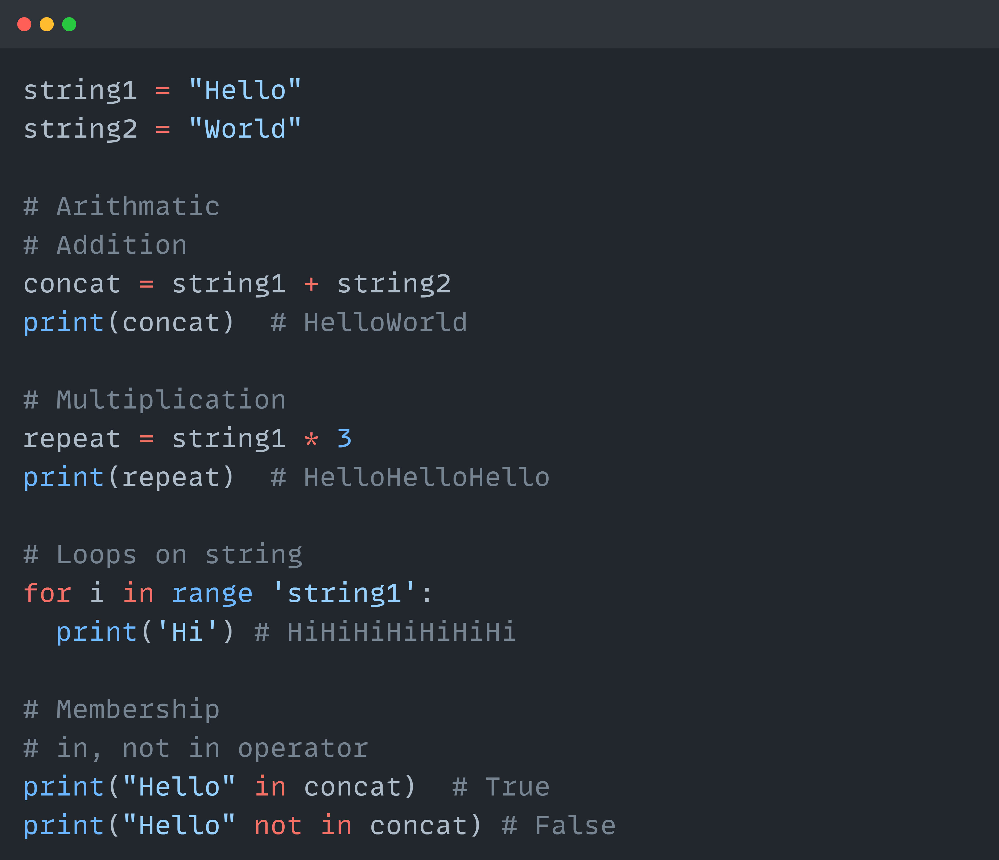

# 🚀 Day 2/75 - Data Science Journey

Hey there! 👋 Welcome back to Day 2 of our 75-Day Data Science Journey!

Today, we dove into the fascinating realm of Python strings, which are super important for working with data. Let's journey together as we learn about strings and discover all the cool things we can do with them!

## Table of Contents:
- [Creating a string](#Creating-a-string)
- [Accessing Substrings from a String](#accessing-substrings-from-a-string)
- [Deleting a String](#deleting-a-string)
- [Operations on String](#operations-on-string)
- [String Functions](#string-functions)
- [Coding Problems](#coding-problems)
- [Bonus Tips](#bonus-tips)

---

### Creating a string
In Python, a string is a sequence of characters enclosed within single, double, or triple quotes.

### Accessing substrings from a string
Substrings can be accessed using indexing and slicing. Indexing starts at 0 for the first character.

#### There are 2 types of indexing:
1. Positive indexing
2. Negative indexing

 

### Deleting a string
Strings in Python are immutable, so you cannot change them directly.

However, you can create new strings based on operations. Deleting can be done using del for variables.

Immutability refers to an object’s inability to be changed after it has been created.

 

### Operations on a string
Various operations like arithmetic, loops on strings, and membership operators can be performed on strings.

 

### String Functions
Python provides many built-in functions to manipulate strings

 

 

 

### Coding problems
Python String Exercises

### Bonus Tips
1. String formatting in Python is the process of embedding variables and expressions within string literals to create dynamic and readable text output.

 

2. A raw string in Python is a string prefixed with r or R, which treats backslashes \ as literal characters, ignoring their escape functionality.

 

Thank you for reading! I’d love to hear your thoughts or questions about this blog on string in Python. Feel free to join the conversation in the comments below!

Let’s continue the discussion on other platforms too. Connect with me on LinkedIn or Github for more data science insights and discussions. If you found this blog helpful, consider sharing it with your network!

Github: [shrutibharat01](https://github.com/shrutibharat01)

LinkedIn: [shrutibhrarat0105](https://www.linkedin.com/in/shrutibharat0105/)
