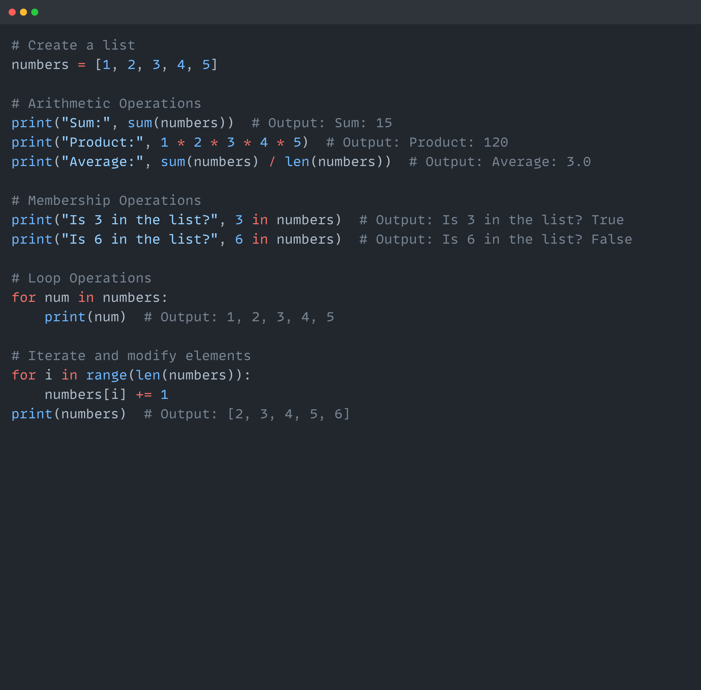

# Python Lists

## 🚀 Day 3/75 - Data Science Journey

Hey 👋!! Welcome back to Day 3 of our 75-day Data Science Journey. Today, we're diving deeper into the world of Python programming and exploring the power of lists. From creating and manipulating lists, we'll cover it all. Let's learn about lists and discover all the cool things we can do with them.

## Table of Contents

- [List](#list)
- [Creating a List](#creating-a-list)
- [Characteristics of List](#characteristics-of-list)
- [Adding Items to the List](#adding-items-to-the-list)
- [Deleting Items from the List](#deleting-items-from-the-list)
- [Operations on List](#operations-on-list)
- [List Functions](#list-functions)
- [List Comprehension](#list-comprehension)
- [Coding Problems](#coding-problems)
- [Bonus Tips](#bonus-tips)

## List

A list is a data structure where you can store multiple items under one name.
Lists act like dynamic arrays, meaning you can add more items on the fly.

### Array Vs List

- **Fixed Vs Dynamic**
- **Homogenous Vs Heterogeneous**
- **Fast Vs Slow**
- **Less memory Vs more memory**

### Memory Allocation
l = [1, 2, 3, 4]

## Creating a list

## Characteristics of list

- A mutable, ordered collection of items.
- Items can be of different types.
- Supports indexing, slicing, and various methods for adding, removing, and modifying elements.

## Adding items to the list

## Deleting items in the list

## Operations on list

## Disadvantages of list

- Limited Readability
- Debugging Challenges
- Slow speed
- Memory Limitations: Takes lots of memory

## List functions

## List comprehension

## Coding problems

## Bonus tips

Python program to interchange first and last elements in a list
Python program to swap two elements in a list
Python | Ways to find length of list
Maximum of two numbers in Python
Minimum of two numbers in Python

Thank you for reading! I’d love to hear your thoughts or questions about this blog on Python list. Feel free to join the conversation in the comments below!

Let’s continue the discussion on other platforms too. Connect with me on LinkedIn or Github for more data science insights and discussions. If you found this blog helpful, consider sharing it with your network!

Github: [shrutibharat01](https://github.com/shrutibharat01)

LinkedIn: [shrutibhrarat0105](https://www.linkedin.com/in/shrutibharat0105/)
